# Images in this repo
[Pre-QC SNPTEST Frequentist Association plot](snptestassoc_freq.png)
[Pre-QC SNPTEST Bayesian Association plot](snptestassoc_baye.png)
[Q-Q plot](qq_plot.png)

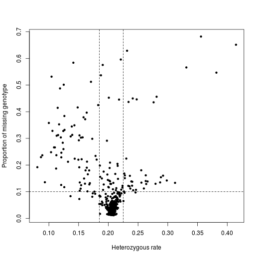

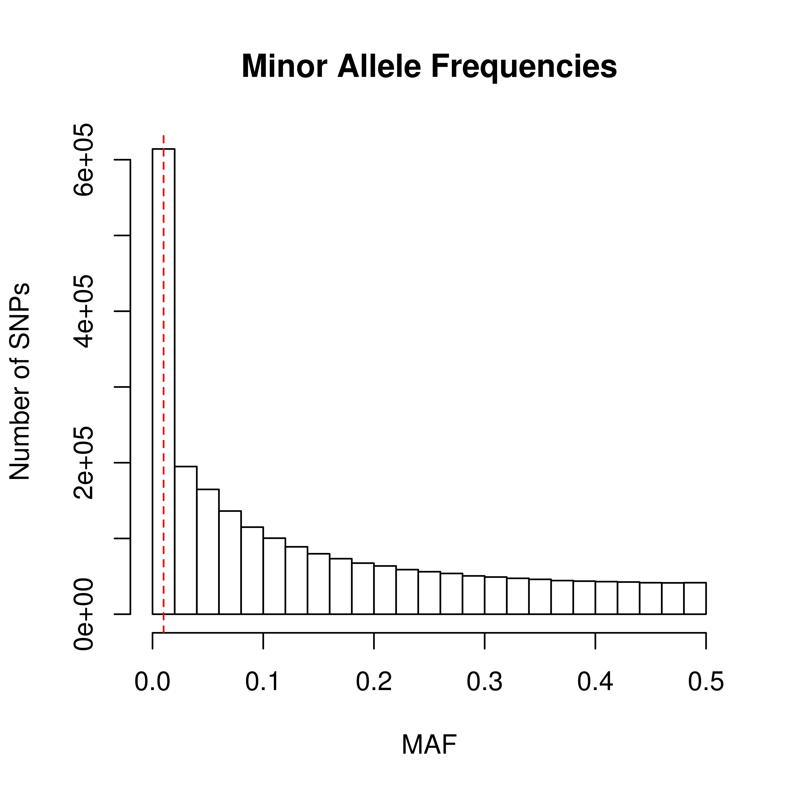
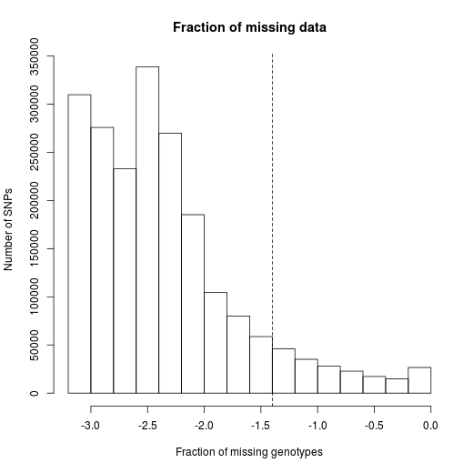
[MDS plot with details on populations of African descent](mds-plot2.png)
[MDS plot of CaseControl and 1KG populations](mds-plot.png)

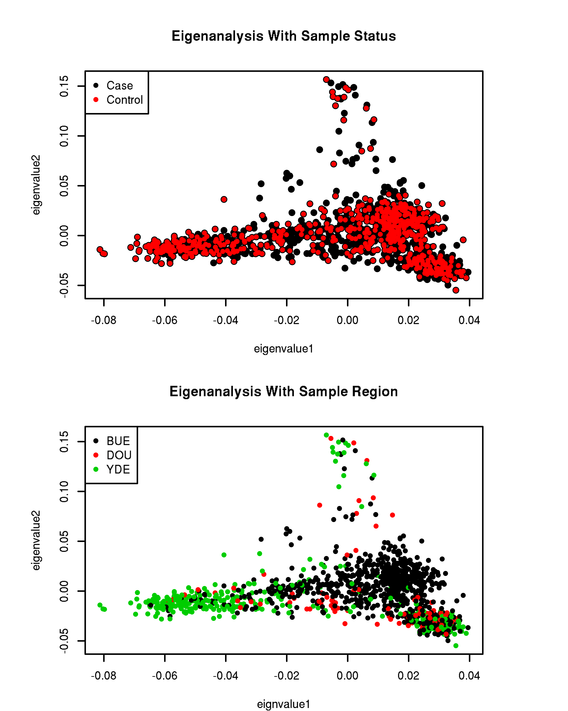
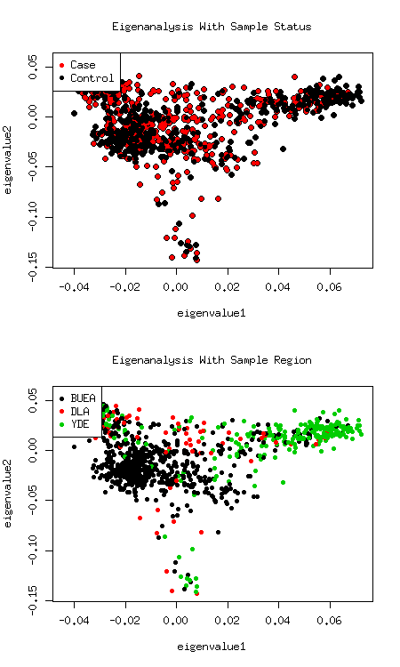
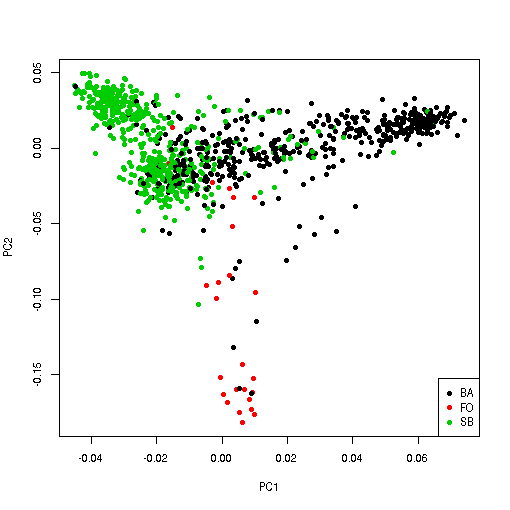
[Association plot](plinkassoc_qc.png)
[Pre-Pop-Struct Association Plot](plinkassoc1_qc.png)
[Pre-Pop-Struct Association plot](plinkassoc2_qc.png)
[Pre-Pop-Struct Association Plot](plinkassoc3_qc.png)
[Post-Pop-Struct Association plot](ps1-assoc_qc.png)
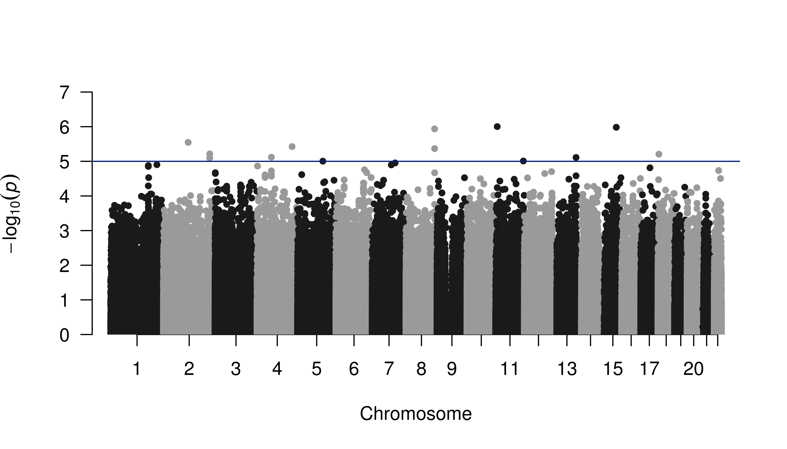
[Post-Pop-Struct Association plot](ps-assoc_qc.png)

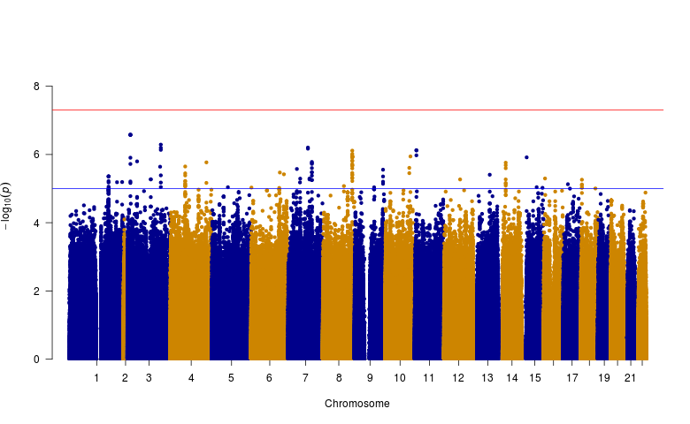

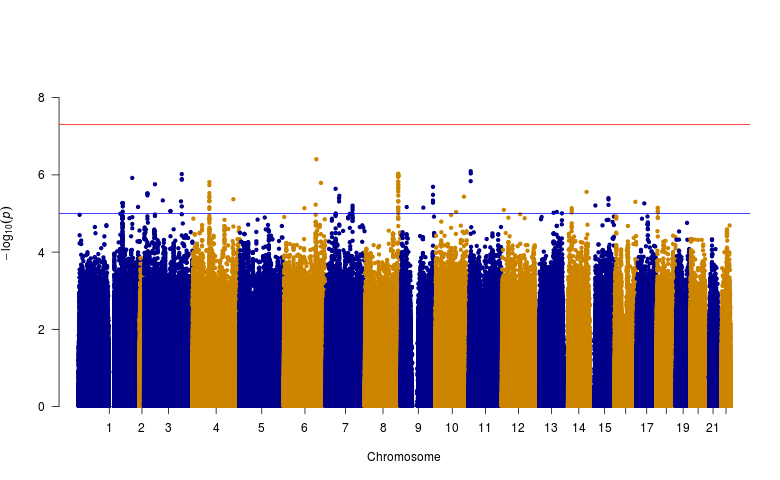
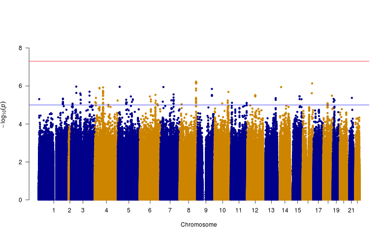
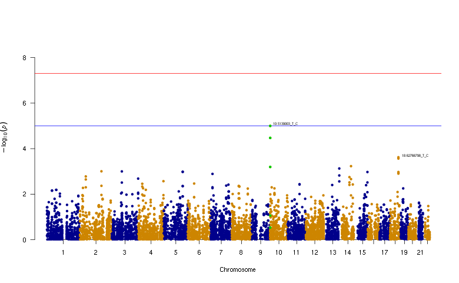
[Population Structure Plot](ps-plot.png)
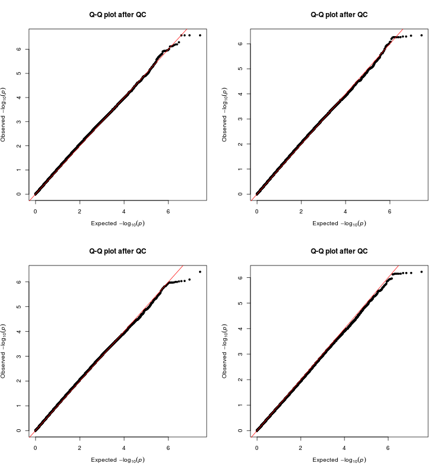

